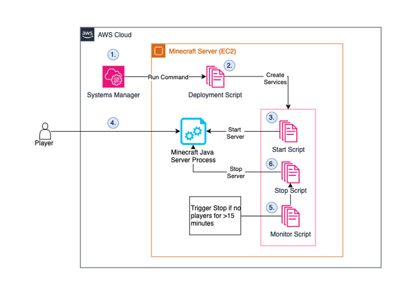

# Cost Optimize Minecraft Server on EC2

## Overview

This script, called the deployment script, is a resource for an AWS blog post that covers how to cost optimize a Minecraft Java server running on Amazon Linux EC2 instances. Essentially, this code will use SSM parameters and a monitoring solution to shut down the EC2 instance.

The architecture diagram below shows how the solution works with the  deploymenet script. Below the diagram is a numbered list corresponding to the diagram to explain what is happening.

1.	The user executes the deployment script on EC2 instance using the AWS Systems manager “run command”. The amount of RAM and idle time before shutdown can be configured by storing values in SSM Parameter Store.
2.	The deployment script creates the various bash scripts and SystemD jobs for the solution. These include starting and stopping the server automatically.
3.	The Minecraft Java server is launched by the “Start Script”.
4.	Players connect to the server.
5.	The “Monitor Script” checks the Minecraft Java server every 60 seconds for active player connections.
6.	After the last player disconnects and the server is empty for a period of time (By default 15 minutes) the “Monitor Script” calls the “Stop Script” to save the Minecraft world and stop the EC2 instance.

We assume the user has followed our previous blog post, 

     
## Security

See [CONTRIBUTING](CONTRIBUTING.md#security-issue-notifications) for more information.

## License

This library is licensed under the MIT-0 License. See the LICENSE file.
